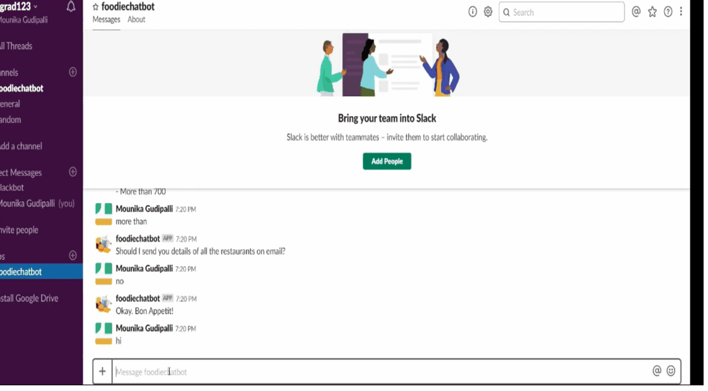
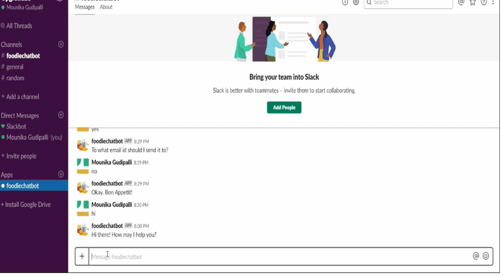

# Foodie Chatbot
Conversational Chatbot for Restaurant Search

Chatbots have become popular in a large number of business domains. Companies are building chatbots for booking hotels, flights, movies etc., customer support, enquiring bus and train schedules, tax saving advice, accessing stock market information etc.

There are two broad types of chatbots - generic chatbots and domain-specific chatbots.

Generic chatbots, also called virtual assistants, such as Google Assistant, Amazon’s Alexa, Microsoft’s Cortana or Apple’s Siri, are used to answer generic queries such as dialling a phone number, dropping a message to a contact, booking a calendar slot, fetching results from a web search, etc. These systems have been trained on massive amounts of user data, encyclopedias, conversational dialogues with humans etc. 

The other type is the domain-specific, task-oriented chatbot. By domain-specific and task-oriented, we mean that it can handle queries pertaining to a particular domain or type of task. For example, a ‘weather bot’ can only tell weather predictions. It cannot book a table in a restaurant or set up an alarm. Similarly, a restaurant discovery bot can help you find restaurants in several cities, though it might not be able to answer general questions such as "Who is the prime minister of India?".

#### Problem Statement

An Indian startup named 'Foodie' wants to build a conversational bot (chatbot) which can help users discover restaurants across several Indian cities. The main purpose of the bot is to help users discover restaurants quickly and efficiently and to provide a good restaurant discovery experience. The project brief provided to you is as follows.

The bot takes the following inputs from the user:

- City: Take the input from the customer as a text field. For example:

        Bot: In which city are you looking for restaurants?
        User: anywhere in Delhi
        
Assume that Foodie works only in Tier-1 and Tier-2 cities. We can use the current HRA classification of the cities from third-party source. Your chatbot should provide results for tier-1 and tier-2 cities only, while for tier-3 cities, it should reply back with something like "We do not operate in that area yet".

- Cuisine Preference: Take the cuisine preference from the customer. The bot should list out the following six cuisine categories (Chinese, Mexican, Italian, American, South Indian & North Indian) and the customer can select any one out of that.
Following is an example for the same:

        Bot: What kind of cuisine would you prefer?
                
        Chinese
        Mexican
        Italian
        American
        South Indian
        North Indian
        User: I’ll prefer Italian!

- Average budget for two people: Segment the price range (average budget for two people) into three price categories: lesser than 300, 300 to 700 and more than 700. The bot should ask the user to select one of the three price categories. For example:

        Bot: What price range are you looking at?

        Lesser than Rs. 300
        Rs. 300 to 700
        More than 700
        User: in range of 300 to 700

While showing the results to the user, the bot should display the top 5 restaurants in a sorted order (descending) of the average Zomato user rating (on a scale of 1-5, 5 being the highest). The format should be: {restaurant_name} in {restaurant_address} has been rated {rating}.

Finally, the bot should ask the user whether he/she wants the details of the top 10 restaurants on email. If the user replies 'yes', the bot should ask for user’s email id and then send it over email. Else, just reply with a 'goodbye' message.

### Building ChatBot using RASA

We are going to use an open source framework for building conversational bots  - RASA.

RASA - An open source Conversational AI is a set of machine learning tools for developers to create contextual text and voice-based chatbots and assistants.

Apple’s Siri, Amazon’s Alexa etc. are much more than a 'speech-based search engine'. Apart from searching for information (e.g. from Wikipedia, YouTube, Google etc.), they can 'talk' to us in natural language. 

Conversation, or dialogue, is a very fundamental aspect of human language, and arguably the most interesting challenge in building truly intelligent NLP systems. A step towards building such systems is domain specific, text-based chatbots used by organisations for tasks such as booking hotels, retrieving stock market information, resolving customer queries etc.

Any conversational system has primarily two components -
 - Natural Language Understanding, or NLU
 - A Dialogue Management System which carries out the overall conversation.
 
In Rasa, these two components are named Rasa NLU and Rasa Core respectively.

Rasa NLU is the tool used for intent classification and entity extraction.

Rasa Core, the dialogue management layer of Rasa, takes structured input in the form of intents and entities (i.e. the output of Rasa NLU) and decides the next actions.

 

 

 

